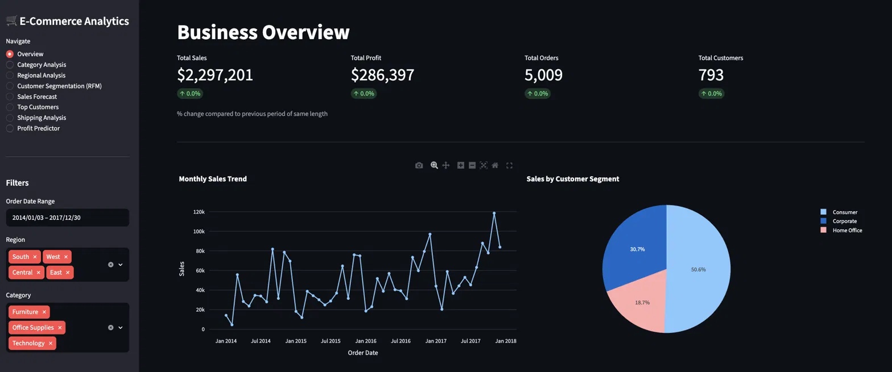
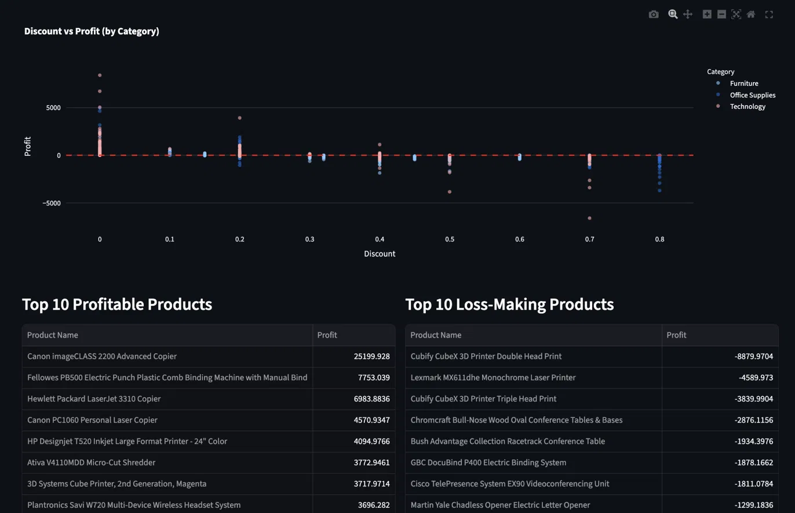
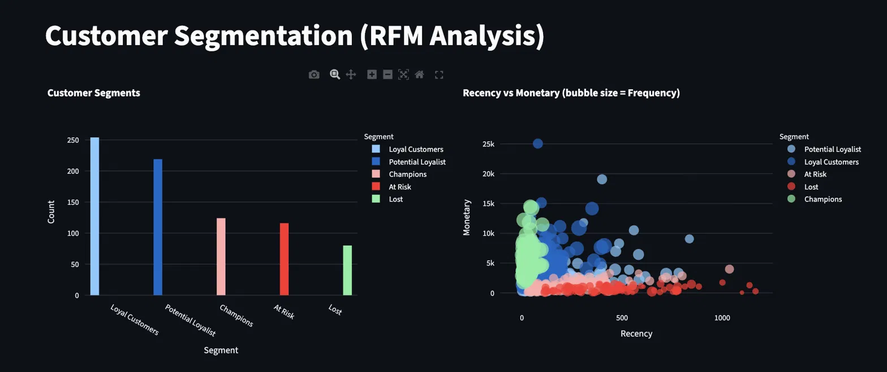
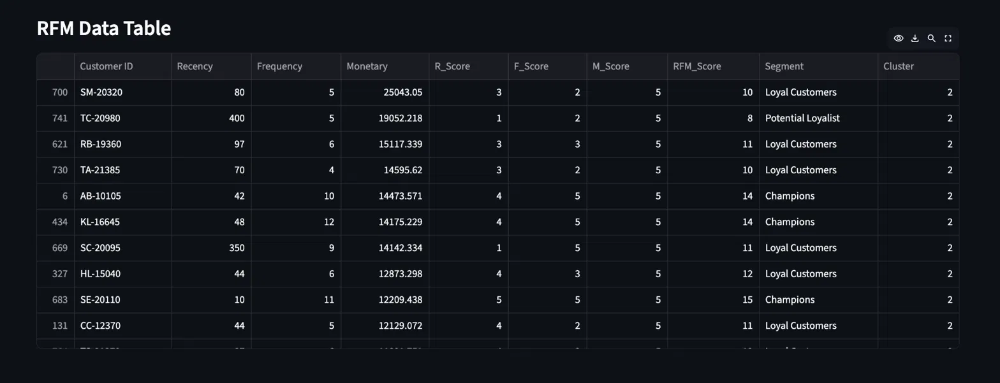
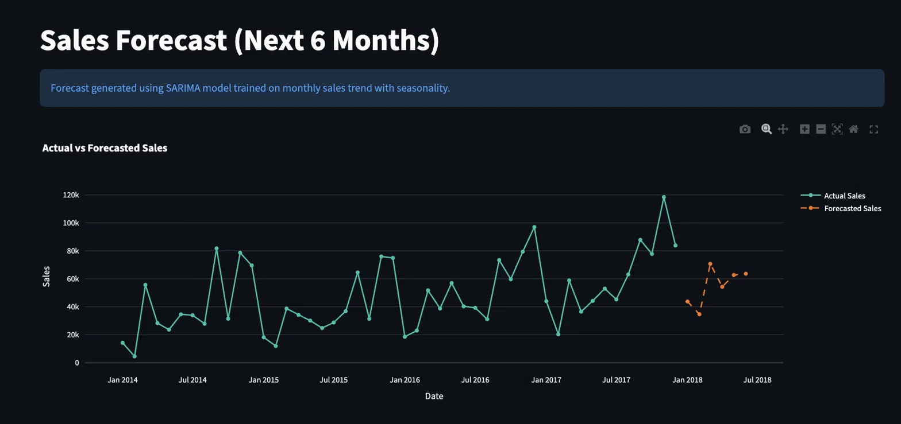
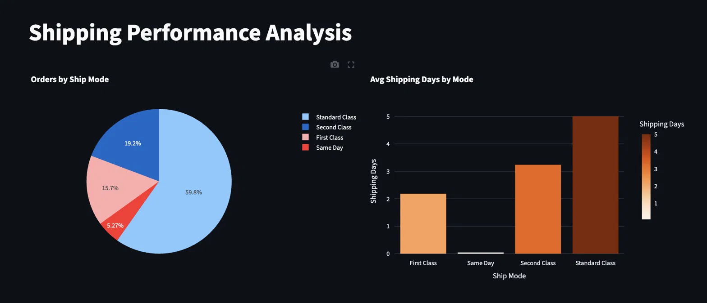
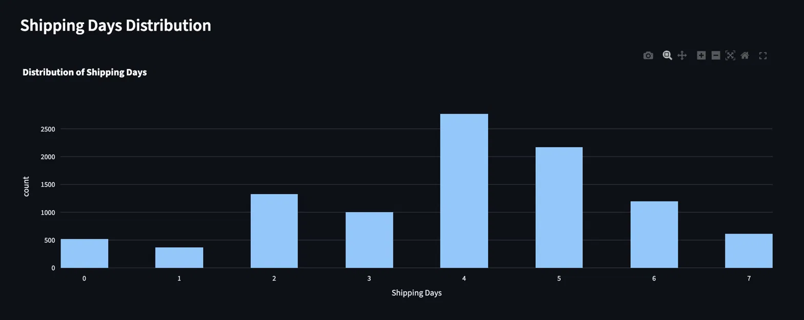

# 🛒 E-Commerce Sales Intelligence & Forecasting System

> An end-to-end data analytics platform analyzing **9,994 retail transactions** across the US (2014–2017), combining exploratory data analysis, customer segmentation via RFM & K-Means, SARIMA time-series forecasting, and an interactive multi-page Streamlit dashboard.

<p align="center">
  
  
  
  
  
</p>

**🔗 Live Demo:** _[Add your Streamlit Cloud link here]_

---

## 🖼️ Screenshots

### 🏠 Business Overview — KPIs, Monthly Sales Trend & Customer Segment Breakdown


### 🗂️ Category Analysis — Discount vs Profit Impact & Top/Bottom Products


### 👥 Customer Segmentation — RFM Segment Counts & Recency vs Monetary Bubble Chart


### 📋 RFM Data Table — Full Scored & Segmented Customer Records


### 📉 Sales Forecast — Actual vs SARIMA 6-Month Forecast


### 🚚 Shipping Performance — Ship Mode Distribution & Avg Delivery Days


### 📦 Shipping Days Distribution — Delivery Time Histogram


### 🤖 Profit Predictor — ML Input Form (Linear Regression)
.png)

---

## 📌 Overview

This project goes far beyond basic sales reporting. It transforms raw transaction data into a **fully interactive business intelligence platform** with:

- Real-time KPI tracking with period-over-period comparisons
- Unsupervised machine learning for customer segmentation
- Statistical time-series forecasting for demand planning
- A predictive ML model for profit estimation

The result is a **production-grade analytics dashboard** that mirrors the kind of tooling used by real data & business intelligence teams.

---

## 📊 Dashboard At A Glance

| Metric | Value |
|---|---|
| 💰 Total Sales | **$2,297,201** |
| 📈 Total Profit | **$286,397** |
| 📦 Total Orders | **5,009** |
| 👥 Unique Customers | **793** |
| 🗓️ Date Range | Jan 2014 – Dec 2017 |
| 🌎 Regions Covered | East, West, Central, South |
| 🏷️ Product Categories | Furniture, Office Supplies, Technology |

---

## ✨ Key Features

### 🏠 1. Business Overview
- 4 dynamic KPI cards (Sales, Profit, Orders, Customers) with **period-over-period % change**
- Monthly Sales Trend line chart with interactive zoom & hover
- Sales breakdown by Customer Segment (Consumer · Corporate · Home Office)
- Global sidebar filters: Date Range, Region, Category — applied across all pages

### 🗂️ 2. Category & Product Analysis
- **Sales vs Profit by Category** — grouped bar chart comparing Furniture, Office Supplies, Technology
- **Treemap** — hierarchical breakdown from Category → Sub-Category by revenue
- **Discount vs Profit Scatter** — visualizes the profit erosion effect of high discounting
- **Top 10 Profitable Products** — led by Canon imageCLASS 2200 Advanced Copier (+$25,199)
- **Top 10 Loss-Making Products** — Cubify CubeX 3D Printer series leading losses (-$8,879)

### 🗺️ 3. Regional & Geographic Analysis
- Sales vs Profit by Region — grouped bar chart across 4 US regions
- **State-level choropleth map** — interactive USA heatmap of sales & profit
- Identifies states generating high sales but net losses (e.g., Texas)

### 👥 4. Customer Segmentation (RFM + K-Means)
- **RFM Scoring** — quantile-based 1–5 scoring on Recency, Frequency, and Monetary dimensions
- Customers classified into: **Champions**, **Loyal Customers**, **Potential Loyalists**, **At Risk**, **Lost**
- **Bubble chart** — Recency vs Monetary with Frequency encoded as bubble size, coloured by segment
- **K-Means Clustering (k=4)** — unsupervised validation of RFM segments on standardized features
- Full sortable RFM data table with R_Score, F_Score, M_Score, RFM_Score, Segment & Cluster columns

### 📉 5. Sales Forecast (SARIMA)
- **SARIMA(1,1,1)×(1,1,1,12)** model trained on monthly aggregated sales
- Produces a **6-month forward forecast** with clear actual vs. predicted overlay
- Dark-themed Plotly chart with colour-coded historical (`#00C2A8`) vs. forecast (`#F97316`) lines
- Forecast values table available for download

### 🏆 6. Top Customers
- Ranked leaderboard by total sales with drill-down into profit and order count
- **Live search bar** to look up any customer by name
- Bar chart: Top 15 customers coloured by profit contribution (Red–Yellow–Green scale)

### 🚚 7. Shipping Performance Analysis
- Pie chart: Order distribution across Standard, Second, First Class, Same Day shipping modes
- Bar chart: Average shipping days per mode
- Histogram: Full distribution of shipping days across all orders

### 🤖 8. Profit Predictor (ML)
- **Linear Regression model** trained on Sales, Quantity, Discount, Category, and Sub-Category
- Interactive input form — enter any hypothetical order parameters
- Instant profit/loss prediction with colour-coded result (✅ profit / ⚠️ loss)
- Dynamically filtered Sub-Category dropdown based on selected Category

---

## 🔑 Business Insights Uncovered

| # | Insight |
|---|---|
| 1 | Discounts **above 20%** consistently produce negative profit margins across all categories |
| 2 | **Furniture** generates significant revenue but has the lowest profit-to-sales ratio of all categories |
| 3 | **Technology** products — especially Copiers — account for a disproportionate share of total profits |
| 4 | High-revenue states like **Texas** operate at a **net loss**, exposing the risk of volume-only thinking |
| 5 | ~25% of customers are **At Risk or Lost**, representing a clear re-engagement opportunity |
| 6 | K-Means clustering confirms RFM segments — a small **Champions cluster** drives outsized revenue |
| 7 | **Same-Day shipping** has the lowest average delivery days but is the least-used mode |

---

## 🛠️ Tech Stack

| Layer | Tools & Libraries |
|---|---|
| **Language** | Python 3.9+ |
| **Data Processing** | Pandas, NumPy |
| **Visualization** | Plotly, Matplotlib, Seaborn |
| **Machine Learning** | Scikit-learn — KMeans, LinearRegression, LabelEncoder |
| **Time-Series Forecasting** | Statsmodels — SARIMA |
| **Dashboard** | Streamlit |
| **Styling** | Custom Streamlit theme (dark mode, `#00C2A8` accent) |
| **Deployment** | Streamlit Community Cloud |

---

## 📂 Project Structure

```
ecommerce-sales-intelligence-forecasting-system/
├── .streamlit/
│   └── config.toml              # Custom dark-theme (bg: #0E1117, accent: #00C2A8)
├── data/
│   ├── Sample-Superstore.csv    # Raw dataset (9,994 rows, 2014–2017)
│   ├── processed_data.csv       # Cleaned & feature-engineered data
│   ├── rfm_data.csv             # RFM scores, segments & K-Means cluster labels
│   └── forecast.csv             # SARIMA 6-month forecast output
├── notebooks/
│   └── 01_data_cleaning.ipynb   # Full pipeline: EDA → RFM → Clustering → Forecasting
├── app/
│   └── app.py                   # Streamlit multi-page dashboard (8 pages, ~270 lines)
├── requirements.txt             # All Python dependencies
└── README.md
```

---

## 🚀 Getting Started

### Prerequisites
- Python **3.9+**
- pip

### 1. Clone the Repository

```bash
git clone https://github.com/<your-username>/ecommerce-sales-intelligence-forecasting-system.git
cd ecommerce-sales-intelligence-forecasting-system
```

### 2. Install Dependencies

```bash
pip install -r requirements.txt
```

### 3. Run the Dashboard

```bash
cd app
streamlit run app.py
```

The app will open automatically at **`http://localhost:8501`**

### 4. (Optional) Regenerate the Analysis Pipeline

To re-run data cleaning, RFM scoring, clustering, and forecasting from scratch:

```bash
cd notebooks
jupyter notebook 01_data_cleaning.ipynb
```

> **Note:** This will overwrite `processed_data.csv`, `rfm_data.csv`, and `forecast.csv` in the `/data` folder.

---

## 📐 Methodology

```
Raw CSV → Data Cleaning → Feature Engineering → EDA
                                                  ↓
                              ┌───────────────────┼───────────────────┐
                              ↓                   ↓                   ↓
                         RFM Scoring        SARIMA Model       Profit Predictor
                              ↓                   ↓                   ↓
                       K-Means Clusters    6-Month Forecast    Linear Regression
                              ↓
                      Streamlit Dashboard (8 Pages)
```

| Step | Description |
|---|---|
| **1. Data Cleaning** | Null checks, duplicate removal, date parsing, derived features: `Shipping Days`, `Profit Margin %` |
| **2. EDA** | Sales/profit trends by time, category, region; discount impact analysis |
| **3. RFM Segmentation** | Quantile scoring (1–5) on Recency, Frequency, Monetary → named customer segments |
| **4. K-Means Clustering** | Standardized RFM features → 4 clusters; Elbow Method used to select optimal K |
| **5. SARIMA Forecasting** | `SARIMA(1,1,1)×(1,1,1,12)` on monthly sales; captures yearly seasonality |
| **6. Profit Prediction** | `LinearRegression` on Sales, Quantity, Discount + encoded Category & Sub-Category |

---

## 📈 Dataset

| Property | Value |
|---|---|
| Name | Sample Superstore |
| Rows | 9,994 transactions |
| Period | January 2014 – December 2017 |
| Geography | United States (49 states) |
| Categories | Furniture · Office Supplies · Technology |
| Source | Tableau / Kaggle public dataset |

---

## 👨‍💻 Author

**Amit Kumar Verma**
B.Tech — Computer Science & Engineering (AI & ML)
Government Engineering College, Jamui

[](https://github.com/<your-username>)
[](https://linkedin.com/in/<your-profile>)

---

## 📄 License

This project is open-source and available under the [MIT License](LICENSE).

---

<p align="center">
  <i>Built as part of a data analytics & ML portfolio — demonstrating end-to-end skills across data engineering, unsupervised machine learning, statistical forecasting, and dashboard deployment.</i>
</p>